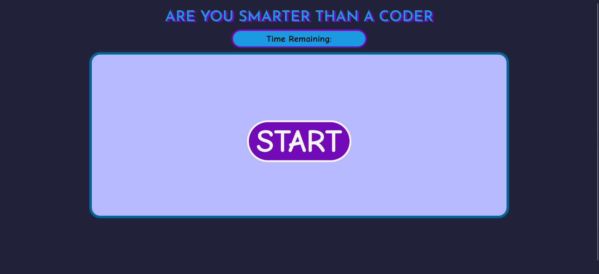

# Are-you-Smarter-than-a-Coder

### Before Pressing Play

### After Pressing Play

### After Finishing Playing 

[Deployment Link](https://tykervella.github.io/Are-you-Smarter-than-a-Coder/)

---

## DESCRIPTION
Week 4 challenge for my UW coding bootcamp. A timed quiz to test your knowledge on HTML, CSS, and JavaScript.

---

## INSTALLATION 

N/A

---

## USAGE

To begin the game, the user will click the "Start" button at the bottom right of the webpage. This will start a 60 second timer and display the first question. 

To answer the question, the user will click on the answer that they wish to select. If the user selection is correct, their score will go up by one and the user will move on to the next question. However, if the user selection isn't correct, 5 seconds will be removed from the timer and the user will move on to the next question. 

After all the questions are answered or when time is up, the game will end. The user's score will be displayed and a "Save your score" button will appear. When the user clicks this button, they will be prompted for their initials. Their input and their score will be saved in localstorage under "High Score". The top four highest scores will be displayed!

---

## CREDITS 

N/A

---

## LICENSE 

MIT License 